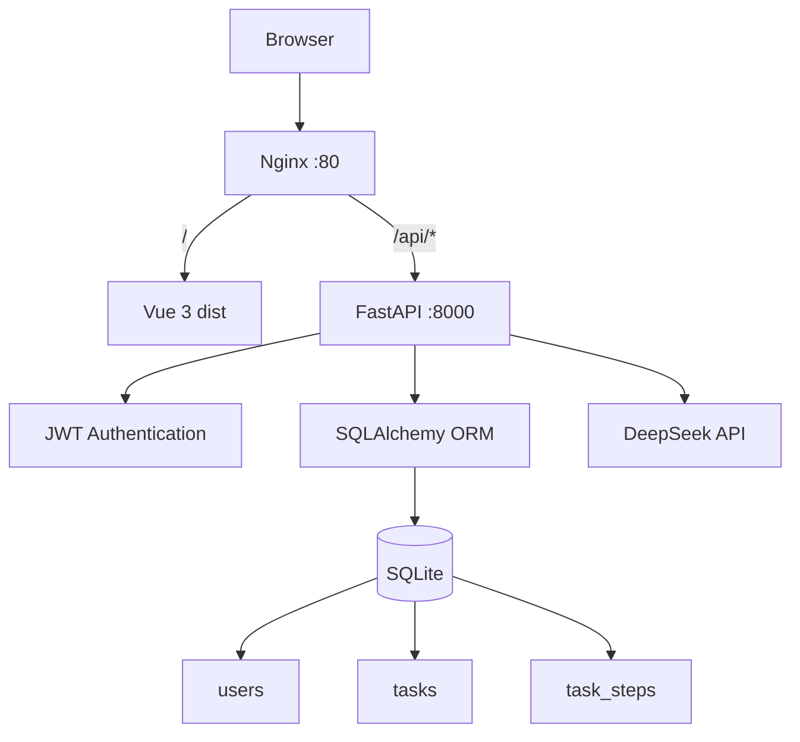
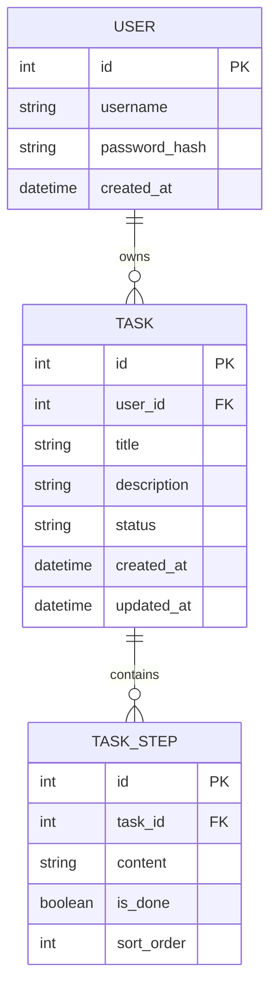

# zero-2-tech

> 从 0 到 1 跑通一个真实的全栈 AI Web 项目：**需求分析 → 架构设计 → 前后端开发 → 数据库 → AI 接入 → Git/GitHub → Ubuntu → systemd → Nginx → 公网上线**。


---

## 项目简介

`zero-2-tech` 是一个用于训练**真实企业工程化能力**的 AI 学习任务管理项目。

它不是为了堆砌复杂功能，而是刻意保持“麻雀虽小，五脏俱全”：用一个可真正完成、可部署、可迭代的小项目，把前端、后端、数据库、AI、认证、Linux 部署和反向代理串成一条完整工程链路。

用户可以注册登录、创建学习任务、管理任务状态，并调用 DeepSeek 将一个学习目标自动拆解成若干可执行步骤；拆解结果可以保存到数据库，并持续记录完成状态。

### 核心目标

```text
想法 / 需求
    ↓
API 与数据模型设计
    ↓
Vue 3 前端
    ↓
FastAPI 后端
    ↓
SQLite + SQLAlchemy
    ↓
DeepSeek API
    ↓
Git / GitHub
    ↓
Ubuntu 24.04
    ↓
systemd
    ↓
Nginx
    ↓
公网访问
```

---

## 核心功能

- **用户系统**
  - 用户注册 / 登录 / 退出登录
  - Argon2 密码哈希
  - JWT Bearer Authentication
  - `/api/auth/me` 登录状态恢复
  - 用户数据隔离

- **学习任务管理**
  - 创建任务
  - 查询任务列表 / 单个任务
  - 修改任务信息与状态
  - 删除任务
  - `todo → doing → done` 状态流转

- **AI 学习计划**
  - 调用 DeepSeek API
  - 将学习目标拆解为结构化步骤
  - AI 结果先预览、后保存
  - 学习步骤持久化到 SQLite
  - 步骤完成状态管理
  - 重新生成 AI 计划并覆盖旧计划

- **Dashboard**
  - 总任务数
  - 已完成任务数
  - 完成率统计

- **工程化能力**
  - 前后端分离
  - REST API
  - SQLAlchemy ORM
  - Alembic 数据库迁移
  - Pydantic 参数校验
  - Axios 请求封装与拦截器
  - Pinia 登录状态管理
  - Vue Router 路由守卫
  - Git / GitHub 版本管理
  - Ubuntu 服务器部署
  - systemd 后台服务托管
  - Nginx 静态资源服务与反向代理

---

## 系统架构



### 开发环境

```text
Browser
   │
   ↓
Vue 3 + Vite
localhost:5173
   │
   │ /api/*
   ↓
Vite Proxy
   │
   ↓
FastAPI + Uvicorn
127.0.0.1:8000
   │
   ├── SQLite
   └── DeepSeek API
```

### 生产环境

```text
Internet
   │
   ↓
Nginx :80
   ├── /      → frontend/dist
   │
   └── /api/* → 127.0.0.1:8000
                     │
                     ↓
                  FastAPI
                   /    \
                  ↓      ↓
               SQLite  DeepSeek
```

---

## 技术栈

| 层级 | 技术 | 作用 |
| --- | --- | --- |
| Frontend | Vue 3 | 页面与交互 |
| Build Tool | Vite | 前端开发服务器与生产构建 |
| Router | Vue Router | SPA 路由 |
| State | Pinia | 用户登录状态管理 |
| HTTP | Axios | 前后端 HTTP 通信 |
| Backend | FastAPI | REST API 与业务后端 |
| Validation | Pydantic | 请求 / 响应模型与参数校验 |
| ORM | SQLAlchemy | Python 对象与数据库映射 |
| Migration | Alembic | 数据库 Schema 版本管理 |
| Database | SQLite | MVP 数据持久化 |
| Auth | JWT + Argon2 | 身份认证与密码安全 |
| AI | DeepSeek API | 学习目标智能拆解 |
| Version Control | Git + GitHub | 本地 / 远程代码管理 |
| Server | Ubuntu 24.04 | 生产运行环境 |
| Process | systemd | FastAPI 后台运行、开机自启、异常重启 |
| Web Server | Nginx | Vue 静态文件服务 + FastAPI 反向代理 |

---

## 数据模型



核心关系：

```text
User 1 ───── N Task 1 ───── N TaskStep
```

所有任务 API 都基于 `current_user` 做权限过滤，因此用户只能访问自己的任务与学习步骤。

---

## 项目结构

```text
zero-2-tech/
│
├── frontend/
│   ├── src/
│   │   ├── api/
│   │   │   ├── http.js
│   │   │   ├── auth.js
│   │   │   ├── tasks.js
│   │   │   ├── taskSteps.js
│   │   │   ├── ai.js
│   │   │   └── dashboard.js
│   │   │
│   │   ├── router/
│   │   │   └── index.js
│   │   │
│   │   ├── stores/
│   │   │   └── auth.js
│   │   │
│   │   ├── views/
│   │   │   ├── LoginView.vue
│   │   │   ├── RegisterView.vue
│   │   │   ├── DashboardView.vue
│   │   │   └── TaskView.vue
│   │   │
│   │   ├── App.vue
│   │   └── main.js
│   │
│   ├── package.json
│   ├── package-lock.json
│   └── vite.config.js
│
├── backend/
│   ├── app/
│   │   ├── core/
│   │   │   ├── config.py
│   │   │   ├── security.py
│   │   │   └── dependencies.py
│   │   │
│   │   ├── models/
│   │   │   ├── user.py
│   │   │   ├── task.py
│   │   │   └── task_step.py
│   │   │
│   │   ├── schemas/
│   │   │   ├── user.py
│   │   │   ├── task.py
│   │   │   ├── task_step.py
│   │   │   ├── ai.py
│   │   │   └── dashboard.py
│   │   │
│   │   ├── routers/
│   │   │   ├── auth.py
│   │   │   ├── tasks.py
│   │   │   ├── ai.py
│   │   │   └── dashboard.py
│   │   │
│   │   ├── services/
│   │   │   └── ai_service.py
│   │   │
│   │   ├── database.py
│   │   └── main.py
│   │
│   ├── migrations/
│   ├── data/
│   ├── .env.example
│   ├── alembic.ini
│   └── requirements.txt
│
├── .gitignore
└── README.md
```

---

## API 概览

### Authentication

| Method | Endpoint | Description |
| --- | --- | --- |
| POST | `/api/auth/register` | 注册用户 |
| POST | `/api/auth/login` | 登录并获取 JWT |
| GET | `/api/auth/me` | 获取当前登录用户 |

### Tasks

| Method | Endpoint | Description |
| --- | --- | --- |
| GET | `/api/tasks` | 获取当前用户任务列表 |
| POST | `/api/tasks` | 创建任务 |
| GET | `/api/tasks/{id}` | 获取单个任务 |
| PUT | `/api/tasks/{id}` | 修改任务 |
| DELETE | `/api/tasks/{id}` | 删除任务 |

### Task Steps

| Method | Endpoint | Description |
| --- | --- | --- |
| GET | `/api/tasks/{id}/steps` | 获取任务步骤 |
| POST | `/api/tasks/{id}/steps` | 保存 / 覆盖任务步骤 |
| PUT | `/api/tasks/{id}/steps/{step_id}` | 修改步骤 |
| DELETE | `/api/tasks/{id}/steps/{step_id}` | 删除步骤 |

### AI

| Method | Endpoint | Description |
| --- | --- | --- |
| POST | `/api/ai/decompose` | 使用 DeepSeek 拆解学习目标 |

### Dashboard

| Method | Endpoint | Description |
| --- | --- | --- |
| GET | `/api/dashboard` | 获取任务统计数据 |

### Health

| Method | Endpoint | Description |
| --- | --- | --- |
| GET | `/api/health` | 服务健康检查 |

开发环境启动后，可访问 FastAPI 自动文档：

```text
http://127.0.0.1:8000/docs
```

---

## 本地开发

### 1. 克隆项目

```bash
git clone git@github.com:Bear-2-bit/zero-2-tech.git
cd zero-2-tech
```

### 2. 启动后端

进入后端：

```bash
cd backend
```

Windows PowerShell：

```powershell
python -m venv .venv
.\.venv\Scripts\Activate.ps1
pip install -r requirements.txt
```

Linux / macOS：

```bash
python3 -m venv .venv
source .venv/bin/activate
pip install -r requirements.txt
```

复制环境变量模板：

```text
.env.example → .env
```

示例：

```env
SECRET_KEY=your-secret-key
ALGORITHM=HS256
ACCESS_TOKEN_EXPIRE_MINUTES=60

DEEPSEEK_API_KEY=your-deepseek-api-key
DEEPSEEK_MODEL=your-deepseek-model
```

> `.env` 包含敏感信息，已加入 `.gitignore`，不要提交到 GitHub。

执行数据库迁移：

```bash
alembic upgrade head
```

启动 FastAPI：

```bash
fastapi dev app/main.py
```

后端地址：

```text
http://127.0.0.1:8000
```

Swagger：

```text
http://127.0.0.1:8000/docs
```

### 3. 启动前端

新开终端：

```bash
cd frontend
npm ci
npm run dev
```

访问：

```text
http://localhost:5173
```

开发环境中，Vite 会把 `/api/*` 请求代理到 FastAPI `127.0.0.1:8000`。

---

## 生产构建

前端：

```bash
cd frontend
npm ci
npm run build
```

生成：

```text
frontend/dist/
```

后端生产运行：

```bash
uvicorn app.main:app --host 127.0.0.1 --port 8000
```

实际服务器中由 `systemd` 托管 Uvicorn/FastAPI，而不是长期手动运行命令。

---

## Ubuntu 部署架构

项目部署目录：

```text
/srv/zero-2-tech
```

后端服务：

```text
systemd
   ↓
zero2tech.service
   ↓
Uvicorn
   ↓
FastAPI
   ↓
127.0.0.1:8000
```

Nginx：

```text
GET /
 ↓
frontend/dist

GET /api/*
 ↓
127.0.0.1:8000
```

典型 Nginx 结构：

```nginx
server {
    listen 80;
    listen [::]:80;

    server_name _;

    root /srv/zero-2-tech/frontend/dist;
    index index.html;

    location / {
        try_files $uri $uri/ /index.html;
    }

    location /api/ {
        proxy_pass http://127.0.0.1:8000;

        proxy_set_header Host $host;
        proxy_set_header X-Real-IP $remote_addr;
        proxy_set_header X-Forwarded-For $proxy_add_x_forwarded_for;
        proxy_set_header X-Forwarded-Proto $scheme;
    }
}
```

---

## 工程化设计

这个项目的重点不只是“功能可以运行”，还刻意实践了以下工程原则：

### 1. 前后端通过 API 契约协作

```text
Vue
 ↓
HTTP / JSON
 ↓
FastAPI
```

前端不直接访问数据库，也不直接调用 DeepSeek。

### 2. AI Key 只存在后端

```text
Vue
 ↓
FastAPI
 ↓
DeepSeek
```

避免将 API Key 打包进前端代码。

### 3. 使用数据库迁移，而不是删除数据库重建

```text
SQLAlchemy Model
 ↓
Alembic Migration
 ↓
SQLite Schema
```

### 4. 认证与授权分离

```text
Authentication
→ 你是谁？

Authorization
→ 你可以访问哪些资源？
```

JWT 用于识别当前用户，所有 Task / TaskStep 查询都会验证资源归属。

### 5. 环境与代码分离

```text
代码            → Git / GitHub
依赖声明        → requirements.txt / package-lock.json
敏感配置        → .env
数据库结构      → Alembic migrations
数据库真实数据  → app.db
```

### 6. 开发与生产职责分离

```text
开发：
Vite :5173
FastAPI :8000

生产：
Nginx :80
FastAPI :8000（仅本机）
```

---

## 项目进度

- [x] Phase 0：项目立项与需求设计
- [x] Phase 1：数据模型 + API + 技术架构
- [x] Phase 2：项目初始化 + Git / GitHub
- [x] Phase 3：FastAPI + SQLAlchemy + SQLite CRUD
- [x] Phase 4：Vue + Axios + FastAPI 前后端联调
- [x] Phase 5：用户系统 + JWT 认证与权限隔离
- [x] Phase 6：DeepSeek AI + TaskStep 持久化 + Vue AI 交互
- [x] Phase 7：Dashboard + 本地 MVP 收尾
- [x] Phase 8：Ubuntu + systemd + Vue Production Build
- [ ] Phase 9：Nginx + 公网正式上线
- [ ] Phase 10：HTTPS / 部署更新 / Docker / Compose / CI/CD

---

## Roadmap

接下来计划继续完成：

```text
Nginx 公网部署
   ↓
域名
   ↓
HTTPS
   ↓
生产更新流程
   ↓
日志 / SQLite 备份
   ↓
Docker
   ↓
Docker Compose
   ↓
GitHub Actions CI/CD
```

进一步可以继续演进：

- SQLite → PostgreSQL / MySQL
- 更完善的前端 UI
- Refresh Token / HttpOnly Cookie
- AI 流式输出
- RAG 企业知识库
- Agent / Tool Calling
- 自动化测试
- 多环境配置（dev / staging / production）

---

## 为什么叫 `zero-2-tech`

这个项目不是一个“跟着教程复制出来的 Demo”，而是一条从 **Zero 到真实工程能力** 的训练路线。

目标不是记住多少框架 API，而是最终能够面对一个新需求时，自己完成：

```text
需求分析
 → 数据模型
 → API 设计
 → 技术架构
 → 前端开发
 → 后端开发
 → 数据库
 → AI
 → Git
 → Linux
 → Nginx
 → 部署
 → CI/CD
```

> **从 0 到 1 做出来，从 1 到 N 做工程化。**
